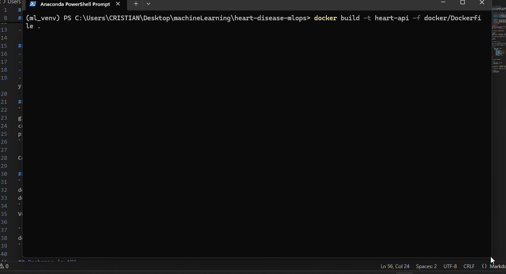

<h2 align="center">Vídeo demostración del Proyecto</h2>

<p align="center">
  
</p>

---

# Heart Disease MLOps

Proyecto integral de despliegue de un modelo de Machine Learning para la predicción de enfermedades cardíacas, que abarca todo el ciclo de vida del modelo:

- Entrenamiento y validación del modelo predictivo.

- Despliegue mediante FastAPI y Docker para ofrecer un servicio escalable y eficiente.

- Orquestación con Kubernetes para garantizar alta disponibilidad y automatización del despliegue.

- Integración continua con GitHub Actions, permitiendo pruebas y actualizaciones automáticas del sistema.

-  Monitoreo de deriva de datos con Evidently, asegurando el rendimiento y la fiabilidad del modelo en producción.

---

## Arquitectura y tecnologías utilizadas

- **FastAPI**: servir modelos como API REST.
- **Kubernetes**: orquestación de contenedores y escalabilidad.
- **GitHub Actions**: integración continua, pruebas y despliegue automático.
- **Evidently**: monitoreo de deriva de datos y performance de los modelos.

## Componentes
- `notebooks/`: Análisis exploratorio, entrenamiento y explicabilidad.
- `app/api.py`: API REST para predicciones.
- `Dockerfile`: Configuración para despliegue.
- `Drift report`: Permite detectar y visualizar cambios en la distribución de los datos a lo largo del tiempo entre los datos de entrenamiento y los datos nuevos

## Instalación
```bash
git clone https://github.com/DAVIDML200555/seccion10.git
cd heart-disease-mlops
pip install -r requirements.txt
```

Construimos la imagen Docker

## Docker
Abrimos Docker Desktop
```bash
docker build -t heart-api -f docker/Dockerfile .
docker run -d -p 8000:8000 --name heart-api-container heart-api
```
Verificamos que la imagen está corriendo con

```bash
docker ps
```

## Probamos la API

Una vez el contenedor esté corriendo, la API estará disponible en: http://127.0.0.1:8000/docs

Dentro del enlace, enviamos un `POST` a `/predict` con un JSON como este:

```json
{
    "model_name": "KNN",
    "features": {
        "Sex": "M",
        "ChestPainType": "ASY",
        "FastingBS": 0,
        "RestingECG": "Normal",
        "ExerciseAngina": "Y",
        "Oldpeak": 0.0,
        "ST_Slope": "Flat"
    } 
}
```

Lo que nos retornará:

```json
{
  "model": "string", 
  "prediction": 0
}
```
- `model_name`: corresponde al modelo seleccionado, las opciones pueden ser: `SVM`, `GaussianNB`, `Logistic Regression L2`, `Logistic Regression L1`, `CatBoost`, `XGBoost`, `Gradient Boosting`, `BernoulliNB`, `Random Forest`, `MultinomialNB` , `KNN`,  `Decision Tree`.

- `prediction`: Predicción final del modelo.

## Autores
- Cristian Linero
- David Marquez


